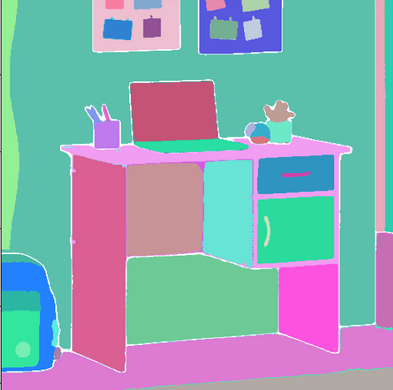

# Object Segmentation and Position Shift using Generative AI

Welcome to the project documentation for Object Segmentation and Position Shifting. This repository contains the code for segmenting an object in a given image based on a text prompt and then moving the object to a new position within the same scene. It leverages cutting-edge generative AI models to accomplish this task in a user-friendly way.

## Table of Contents

* [Overview](#overview)
* [Features](#features)
* [Installation](#installation)
* [Usage](#usage)
    * [Task 1: Object Segmentation](#task-1-object-segmentation)
    * [Task 2: Object Position Shifting](#task-2-object-position-shifting)
* [Results](#results)
* [Challenges and Future Work](#challenges-and-future-work)
* [Contributing](#contributing)
* [License](#license)
* [References](#references)


## Overview

This project involves two key tasks aimed at post-production editing of product images, particularly for e-commerce purposes.

* Task 1: Segments an object in the image based on a text prompt (e.g., "shelf") and highlights it with a red mask.
    
* Task 2: Moves the object within the scene by shifting it in the x and y directions, as specified by the user.

### Example Use Case

For instance, you may have an image containing a "shelf." You can run the segmentation to highlight all shelves in the image. Then, you can move the identified shelf within the scene using pixel offsets.

## Features

* Text-based Object Segmentation: Identifies objects using class prompts like "shelf" and highlights them.
    
* Position Shift: Moves the object by pixel values in the x (horizontal) and y (vertical) directions.
    
* Pre-built models: Leverages existing models like SAM (Segment Anything Model) and Stable Diffusion Inpainting for object manipulation without requiring retraining.

## Installation

To set up the project locally, follow these steps:

1. Clone the Repository:

    ```bash

        git clone https://github.com/your-repo/object-segmentation-shift.git
        cd object-segmentation-shift
    ```

2. Create and Activate a Virtual Environment:

    ```bash

        python -m venv venv
        source venv/bin/activate  # On Windows, use `venv\Scripts\activate`
    ```

3. Install Dependencies:

    ```bash
        pip install -r requirements.txt
    ```

## Usage

### Task 1: Object Segmentation

To segment an object in an image based on a class prompt:

```bash
    python run.py --image ./example.jpg --class shelf --output ./generated.png
```

This command will take `example.jpg`, segment all instances of the object specified in the class prompt (e.g., "shelf"), and output an image with red masks on those objects.

### Task 2: Object Position Shifting

To shift the segmented object in the image:

```bash
    python run.py --image ./example.jpg --class shelf --x 80 --y 0
```

This will move the identified shelf 80 pixels to the right and 0 pixels in the vertical direction.

## Results

Here are the results from applying the algorithm to sample images:

| Input Image   | Segmentation (Task 1) | Shifted Object (Task 2) |
| :-------------: | :---------------------: |  :--------------------:   | 
| Data          | res1                  |          res2           |


* Task 1: The object is highlighted in red.

    * Before segmentation

        
    
    * After segmentation

        

* Task 2: The object is shifted as per the user-defined x and y values.

## Challenges and Future Work

### Challenges:

* Complex Object Boundaries: In cases where objects have intricate boundaries or are partially obscured, segmentation may not be perfect.
    
* Shifting Artifacts: When moving objects with complex backgrounds, ensuring that the background regenerates naturally poses challenges.

### Future Improvements:

* Fine-tuning Models: Experimenting with fine-tuning techniques to improve segmentation precision.
    
* Seamless Background Inpainting: Using advanced inpainting techniques to handle background reconstruction after object movement.

## Contributing

If you'd like to contribute to this project, please follow these steps:

1. Fork the repository.
2. Create a new branch (git checkout -b feature/YourFeature).
3. Commit your changes (git commit -m 'Add some feature').
4. Push to the branch (git push origin feature/YourFeature).
5. Open a Pull Request.

## License

This project is licensed under the MIT License. See the [LICENSE](https://github.com/Namneet2001/Avatar-Assessment/blob/main/LICENSE) file for details.

## References

* [Segment Anything Model (SAM)](https://segment-anything.com/)
* [Stable Diffusion Inpainting](https://huggingface.co/runwayml/stable-diffusion-inpainting)
* [Stable Diffusion v2](https://huggingface.co/runwayml/stable-diffusion-inpainting)
